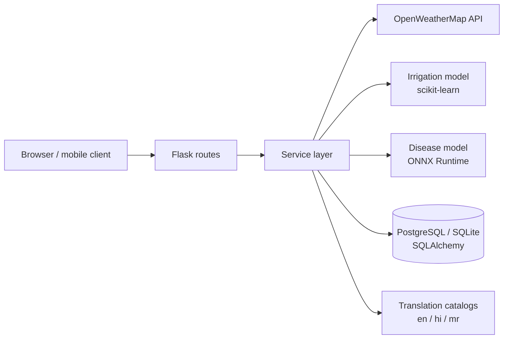

# Farm Saathi — Smart Irrigation & Crop Advisory

A farmer-friendly web application that answers practical field questions in plain language: **should I water today?**,
**what is wrong with this leaf?**, and **what should I check next?** It combines live weather, a machine-learning
irrigation model and a plant-disease image classifier, and it speaks **English, Hindi (हिन्दी) and Marathi (मराठी)**.

**Live demo:** https://smart-irrigation-pi6v.onrender.com &nbsp;·&nbsp; *(hosted on a free tier, so the first request may take a minute to wake up)*


<!--
  Add screenshots here once you have them, for example:
  
  
-->

---

## Table of contents
1. [Features](#features)
2. [How it works](#how-it-works)
3. [Quick start](#quick-start)
4. [Configuration](#configuration)
5. [API](#api)
6. [Machine learning](#machine-learning)
7. [Languages](#languages)
8. [Testing](#testing)
9. [Deployment](#deployment)
10. [Project structure](#project-structure)
11. [Limitations and responsible use](#limitations-and-responsible-use)
12. [Roadmap](#roadmap)
13. [Data sources and acknowledgements](#data-sources-and-acknowledgements)

---

## Features

| Area | What it does |
|---|---|
| **Irrigation advice** | Combines live weather (OpenWeatherMap), soil type, crop stage and field size to say whether to water today, how many litres, and a 7-day outlook |
| **Plant disease check** | Upload a leaf photo and get the most likely crop disease with a confidence score and practical advice (38 classes across 14 crops) |
| **Crop health, soil, fertilizer, pest guides** | Symptom-based first-check guidance and plain-language explanations of soil readings, with safety notes instead of fixed chemical doses |
| **Farm plan** | A simple checklist for routine field work |
| **Records and reports** | Every irrigation check is saved; each result can be re-opened and downloaded as an Excel report |
| **Three languages** | The whole site, including results, disease names, advice, errors and the Excel report, in English, Hindi and Marathi |
| **JSON API** | Endpoints for a mobile client, with ready-to-show translated text |

## How it works



The code is split into three layers: **routes** handle HTTP only, **services** hold the business logic (weather, irrigation,
disease inference, advice, reports, translation), and **database** holds the SQLAlchemy models. Services return
language-neutral text, which is translated only when it is displayed. That is why a result page can be switched between
languages without recomputing anything.

## Quick start

```bash
git clone https://github.com/Shubhveer/smart-irrigation.git
cd smart-irrigation

python -m venv venv
venv\Scripts\activate            # Windows
# source venv/bin/activate       # macOS / Linux

pip install -r requirements.txt

cp .env.example .env             # then add your OpenWeatherMap key (see Configuration)
python app.py
```

Open http://127.0.0.1:5000. SQLite is used automatically for local development.

## Configuration

Set these in `.env` (local) or in your hosting dashboard (production). See `.env.example`.

| Variable | Required | Purpose |
|---|---|---|
| `OPENWEATHER_API_KEY` | Yes | Live weather and forecast. Free key: https://openweathermap.org/api |
| `FLASK_SECRET_KEY` | Yes in production | Signs session cookies. Use a long random string |
| `DATABASE_URL` | No | PostgreSQL URL in production. Defaults to `sqlite:///./irrigation.db` |
| `FLASK_DEBUG` | No | `true` for local development, `false` in production |

Never commit `.env`. It is listed in `.gitignore`.

## API

Language for the text in a response: the `lang` field (JSON) or `?lang=` query (`en`, `hi`, `mr`), otherwise the
`Accept-Language` header, otherwise English. Machine-readable fields never change with language.

### `POST /api/irrigation`

```bash
curl -X POST http://127.0.0.1:5000/api/irrigation \
  -H "Content-Type: application/json" \
  -d '{"location": "Nagpur", "soil_type": 1, "crop_stage": 1, "field_size": 2, "lang": "hi"}'
```

`soil_type`: 0 sandy, 1 loamy, 2 clay. `crop_stage`: 0 newly planted, 1 growing, 2 flowering, 3 near harvest.
`field_size` is in the units used by the app (default 1).

Response shape (values are illustrative):

```json
{
  "success": true,
  "lang": "hi",
  "prediction_id": 12,
  "location": "Nagpur",
  "weather": { "temperature": 34.0, "humidity": 28.0, "rainfall": 0.0 },
  "irrigation": { "needed": true, "water_today": 800, "alert": "Irrigation Required", "alert_text": "सिंचाई आवश्यक" },
  "weather_alerts": ["LOW_HUMIDITY"],
  "weather_alerts_text": ["नमी कम है, इसलिए मिट्टी सामान्य से जल्दी सूख सकती है।"],
  "recommendations": ["IRRIGATE_TIME"],
  "recommendations_text": ["तेज़ गर्मी के बजाय सुबह जल्दी या शाम को पानी दें।"],
  "week_prediction": [{ "day": "Monday", "day_text": "सोमवार", "irrigation": "Irrigation Required", "irrigation_text": "सिंचाई आवश्यक", "water": 800 }]
}
```

### `POST /api/disease-detect`

Send a JPG/JPEG up to 5 MB as multipart field `image`.

```bash
curl -F "image=@leaf.jpg" "http://127.0.0.1:5000/api/disease-detect?lang=en"
```

```json
{
  "lang": "en",
  "confident": true,
  "finding": "Apple: Black rot (100% confidence)",
  "recommendation": "Fungal disease: improve drainage and avoid over-watering. Preliminary AI result. Confirm with an agriculture officer before applying any pesticide.",
  "top_predictions": [
    { "plant": "Apple", "disease": "Black rot", "confidence": 1.0, "plant_text": "Apple", "disease_text": "Black rot" }
  ]
}
```

Blank or non-photo images are rejected ("No leaf detected"), and predictions below 60% confidence ask for a clearer photo
instead of guessing.

### Web pages

`/` dashboard and irrigation form · `/result/<id>` saved result · `/download/<id>` Excel report · `/history` records ·
`/crop-health` · `/soil` · `/fertilizer` · `/pest` · `/farm-plan` · `/image-check` · `/government-news` ·
`/set-language/<en|hi|mr>`

## Machine learning

### Plant disease detection

| | |
|---|---|
| Data | [PlantVillage](https://github.com/spMohanty/PlantVillage-Dataset): 54,305 colour leaf images, 38 classes, 14 crops |
| Model | MobileNetV3-Large (ImageNet-pretrained) with a classifier head trained on extracted features, exported as one 17 MB ONNX file |
| Training data used | 20,923 images (up to 600 per class) after removing 21 exact duplicates; split 16,738 / 2,092 / 2,093 |
| Held-out result | **97.6% accuracy, macro-F1 0.976** (`models/disease_model_info.json`, per-class report in `models/test_report.txt`) |
| Cost | About 7 minutes on a single CPU core. No GPU and no 2 GB download needed |
| Serving | `onnxruntime` on CPU. No PyTorch or TensorFlow on the server |

**Read these numbers carefully.** The exploratory analysis (`eda/plantvillage/plantvillage_eda.ipynb`) found that PlantVillage is
a lab-style dataset: classes are very imbalanced (5,507 images in the largest class vs 152 in the smallest), only one of the 38
classes is a pest (tomato spider mites), and the background alone predicts the class far above chance (32.2% accuracy from four
corner patches vs 2.6% for random guessing). Test accuracy on this data is therefore optimistic. Expect lower accuracy on
real field photos, and always confirm a diagnosis with an agriculture professional.

Retrain on a laptop: `python ml/train_cpu_transfer.py` (see [`docs/TRAINING_GUIDE.md`](docs/TRAINING_GUIDE.md) for VS Code, GPU
and troubleshooting).

### Irrigation model

An SVM classifier predicts whether irrigation is needed from temperature, humidity, rainfall, soil type and crop stage.
`eda/smart_irrigation_eda.ipynb` compares six algorithms (Logistic Regression, KNN, Decision Tree, Random Forest, SVM,
Gradient Boosting) on the real [Smart Agriculture Dataset](https://www.kaggle.com/datasets/chaitanyagopidesi/smart-agriculture-dataset).

> **Model status:** the deployed `irrigation_model.pkl` was trained on synthetic, rule-based data, so treat its output as
> guidance only. A real-data trainer is included (`python train_model.py`, after saving the Kaggle CSV to
> `eda/data/smart_agriculture_dataset.csv`). Switching the app to it needs a mapping from the form's soil and stage options to the
> dataset's categories; see Section 17 of `eda/README.md`.

## Languages

All text is translated on the server, so pages, form options, results, disease names, advice, error messages, the Excel report
and API text are covered. Visitors choose a language with the buttons in the top bar (their browser language is used on the first
visit). Catalogs live in `translations/hi.json` and `translations/mr.json`. How to edit them or add a language:
[`docs/TRANSLATIONS.md`](docs/TRANSLATIONS.md). Agriculture terms were written for this project and benefit from review by a
native speaker or local agriculture officer.

## Testing

```bash
python -m unittest tests.test_i18n -v
```

15 tests open every page in every language, submit every form variant, run all 38 disease classes, call the API and build the
Excel report. They fail if any text is untranslated or any English word remains in a Hindi or Marathi page.

## Deployment

Deployed on Render (web service + managed PostgreSQL).

- **Build command:** `pip install -r requirements.txt`
- **Start command:** `gunicorn app:app` (also in `Procfile`)
- **Environment variables:** `OPENWEATHER_API_KEY`, `FLASK_SECRET_KEY`, `FLASK_DEBUG=false`, `DATABASE_URL`

The server needs only `requirements.txt`. Training and EDA packages are in `requirements-ml.txt` and are not installed in
production. The trained model files in `models/` are committed (about 17 MB).

## Project structure

```
smart-irrigation/
├── app.py                         # app factory and error handlers
├── Procfile, requirements.txt, requirements-ml.txt, .env.example
├── routes/                        # HTTP layer: predict, farm, farmer_extra, api, i18n
├── services/                      # weather, irrigation, disease, image screening, advice, reports, i18n
├── database/                      # SQLAlchemy models and session
├── templates/  static/            # Jinja2 pages and CSS
├── translations/                  # hi.json, mr.json
├── models/                        # disease_model.onnx, labels, metrics, confusion matrix
├── irrigation_model.pkl           # currently deployed irrigation model
├── train_model.py                 # real-data irrigation trainer
├── ml/                            # train_cpu_transfer.py (recommended), train_disease_model.py (GPU)
├── eda/                           # irrigation EDA + PlantVillage EDA notebooks and splits
├── tests/                         # translation and completeness tests
├── docs/                          # TRAINING_GUIDE.md, TRANSLATIONS.md
└── flutter_application_1/         # Flutter prototype of the mobile UI (farm_saathi/)
```

## Limitations and responsible use

- **Advice, not diagnosis.** Disease results are preliminary and every one says to confirm with an agriculture officer before
  applying any pesticide or fungicide. Fertilizer guidance deliberately gives no fixed doses.
- **Closed set.** The disease model only knows 38 classes (14 crops). It cannot recognise other crops, most pests, or
  conditions outside those classes.
- **Lab images.** Accuracy on field photos is expected to be lower than the reported test score.
- **Irrigation model.** See the model-status note above.
- **No user accounts yet.** The history list is shared, not per farmer.
- **Text-to-speech and installable-app (PWA) assets** exist in `static/` but are not wired into the current templates.
- **Mobile.** The Flutter app is a UI prototype and does not yet call the API.

## Roadmap

- [ ] Switch the live irrigation model to the real-data model and add a soil-moisture input
- [ ] Fine-tune and evaluate the disease model on real field photographs
- [ ] Per-farmer accounts and private history
- [ ] Connect the Flutter app to the JSON API
- [ ] Re-enable text-to-speech readout and installable-app support
- [ ] Native-speaker review of the Hindi and Marathi agriculture terms

## Data sources and acknowledgements

- **PlantVillage** dataset: Hughes & Salathé (2015), *An open access repository of images on plant health to enable the development
  of mobile disease diagnostics*; Mohanty, Hughes & Salathé (2016), *Using deep learning for image-based plant disease detection*.
- **Smart Agriculture Dataset** on Kaggle (irrigation model data).
- **OpenWeatherMap** for weather and forecasts.
- **timm** (PyTorch Image Models) for the MobileNetV3 ImageNet weights; **ONNX Runtime** for inference.

## Author

**Shubh Veerwani** · [@Shubhveer](https://github.com/Shubhveer)

Feedback and suggestions are welcome through [issues](https://github.com/Shubhveer/smart-irrigation/issues).
